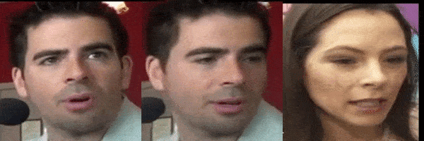
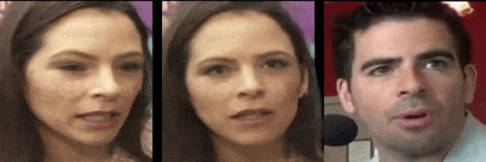

# Geometry Driven Progressive Warping for One-Shot Face Animation (BMVC 2022)

<table>
  <tr>
    <td> </td>
    <td> </td>
    <td> </td>
   </tr> 
</table>
<table>
   <tr>
    <td> </td>
    <td> </td>
   </tr>
</table>

This is the offical pytorch implementation of GDPW (**G**eometry **D**riven **P**rogressive **W**arping for One-Shot Face Animation, BMVC 2022).

GDPW uses 3D face geometry to guidance the facial motion transfer. GDPW can be used for face reneactment and face editing (including facial shape, expression and pose). Please refer to our [paper](https://arxiv.org/abs/2210.02391) for more details.


## Getting Started
### Clone the repo:
 ```bash
 git clone https://github.com/yataoz/face_reenact_GDPW.git
 cd face_reenact_GDPW
 ```  
### Set up environment: 
- GDPW requires differentiable rendering. We use [nvdiffrast](https://github.com/NVlabs/nvdiffrast) for the rendering component.  
    - We recommand installing nvdiffrast with docker. Before installing nvdiffrast, you need to install [docker](https://docs.docker.com/engine/install/ubuntu/) and [nvidia container](https://docs.nvidia.com/datacenter/cloud-native/container-toolkit/install-guide.html#pre-requisites). 
    - Follow the instructions [here](https://nvlabs.github.io/nvdiffrast/) to install nvdiffrast on Linux. 
    
- Add python dependencies to the nvdiffrast docker image.
    - Get the docker image id of the installed nvdiffrast (default name `gltorch:latest`) by running:
        ```bash
        docker images
        ```
    - Suppose you're already in the face_reenact_GDPW directory. Create a docker container with the docker image:
        ```bash
        docker run -it -v `pwd`:/app --workdir /app <image_id> /bin/bash
        ```
    - Install python dependencies in the docker container:
        ```bash
        pip install -r requirements.txt
        ```
    - Reinstall nvdiffrast and then exist container:
        ```bash
        cd /tmp/pip && pip install . && exit
        ```
    - Back in the host terminal, get the id of the docker container you just exited by running:
        ```bash
        docker ps -a
        ```
    - Commit changes from container to image:
        ```bash
        docker commit <container_id> gltorch:face_reenact_GDPW
        ```
        `gltorch:face_reenact_GDPW` is the new image name.

### Data and model preparation:
1. Test demo requires online 3DMM fitting, for which we rely on [DECA](https://github.com/YadiraF/DECA). The `Fit-DECA/decalib` folder contains a modified version of the DECA fitter. 

    - Download data and pre-trained model for DECA:
        ```bash
        cd ./Fit-DECA
        bash fetch_data.sh
        cd ..
        ```
2. Download pre-trained models and sample test/train data.
    - Download from [goodle drive](https://drive.google.com/drive/folders/149O2EpAh_mOW1s7INnKaa3BrV0Zv00D6?usp=share_link).
    - Place the `./data` and `./checkpoints` folders right under the root directory of face_reenact_GDPW.
        
### Run face reenactment demo:
1. Create a docker container with the docker image:
    ```bash
    bash run_in_docker.sh
    ```
    Please make sure your docker image with the added dependecies is named `gltorch:face_reenact_GDPW`.

2. In the docker container, simply run:
    ```bash
    bash run_face_reenact_demo.sh
    ```
    - You can change the `GUIDANCE` to switch between models with different types of geometric guidance.
    - You can change the `SRC_IMG` and `DRIVING_VIDEO` to test images/videos of your own choice.

### Run face editing demo:
1. Create a docker container with the docker image:
    ```bash
    bash run_in_docker.sh
    ```
    Please make sure your docker image with the added dependecies is named `gltorch:face_reenact_GDPW`.

2. In the docker container, simply run:
    ```bash
    bash run_face_edit_demo.sh
    ```
    - You can change the `GUIDANCE` to switch between models with different types of geometric guidance.
    - By setting `INTERACTIVE=0`, the model will animate/edit the input face with some presets. Output will be saved as face_reenact_demo_video.mp4.
    - By setting `INTERACTIVE=1`, you can edit the face image by chaning the 3D face (FLAME specifically) parameters. Output will be saved as face_edit_output_img.jpg.
        - Change the shape by supplying `shape <dim> <value>` in the terminal prompt. E.g. `shape 0 1.5` will set the dim 0 of the shape param to 1.5. Note that the shape param has 100 dimensions and each value must be in [-2, 2].
        - Change the expression by supplying `exp <dim> <value>` in the terminal prompt. E.g. `exp 0 -1` will set the dim 0 of the expression param to -1. Note that the expression param has 50 dimensions and each value must be in [-2, 2].
        - Change the global head pose by supplying `global_pose <yaw, pitch or roll> <angle>` in the terminal prompt. E.g. `global_pose yaw -10` will set the yaw angle of global head pose to -10 degrees.
        - Change the jaw pose by supplying `jaw_pose <yaw, pitch or roll> <angle>` in the terminal prompt. E.g. `jaw_pose pitch 5` will set the pitch angle of jaw pose to 5 degrees. 
        - Change the camera by supplying `cam <scale, tx or ty> <value>` in the terminal prompt. E.g. `cam scale 10` will set the camera scale to 10 and `cam tx -2` will set the camera horizontal shift to -2. 
        - Multiple changes can be applied all at once in a single terminal prompt. For example:
            ```
            shape 0 1.5 exp 0 -1 global_pose yaw -10 jaw_pose pitch 5 cam scale 10
            ```
        - Use `reset` in the terminal prompt to undo all changes/edits.

### Train the model:
We do not provide the full training data here due to the large size of the VoxCeleb dataset. We provide several pre-processed training samples in `data/sample_train` (which you should have already downloaded from google drive). What we do in pre-processing is running the DECA fitter on the face images and save the FLAME mesh vertices that are projected to image space.

1. Create a docker container with the docker image:
    ```bash
    bash run_in_docker.sh
    ```
    Please make sure your docker image with the added dependecies is named `gltorch:face_reenact_GDPW`.

2. In the docker container, simply run:
    ```bash
    bash run_training.sh
    ```
    Again, you can choose which guidance to use by changing the GUIDANCE param in the bash script.

### Acknowledgement:
We would like to thank authors of the projects below for open sourcing their code.
- [FLAME face model](https://flame.is.tue.mpg.de/)
- [DECA](https://github.com/YadiraF/DECA)
- [nvdiffrast](https://github.com/NVlabs/nvdiffrast)